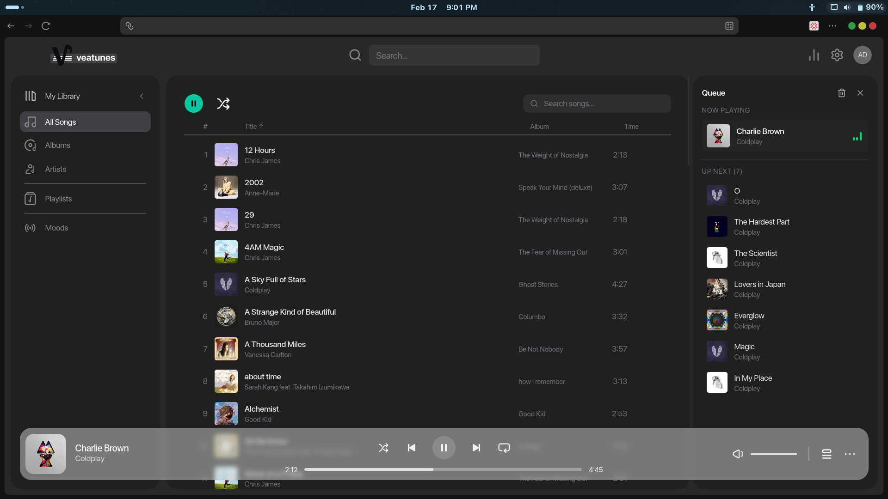
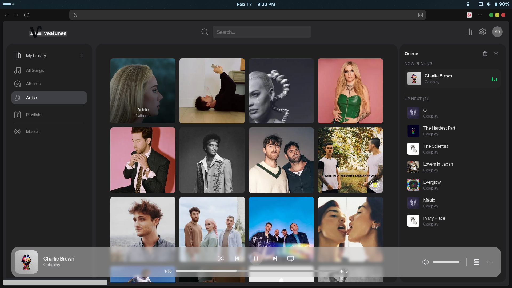
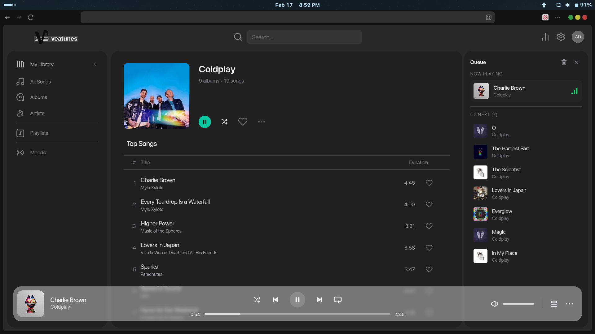
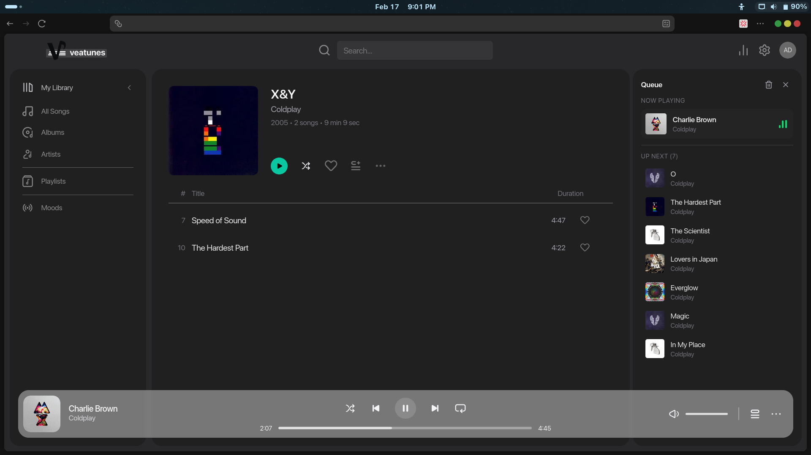
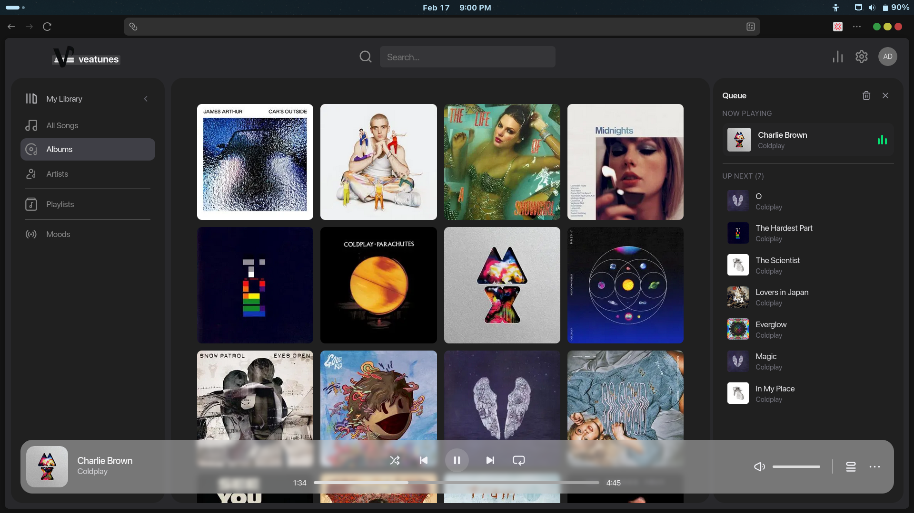
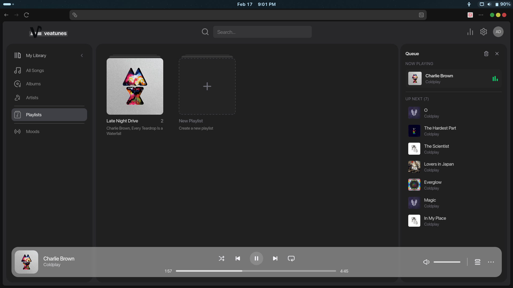

<p align="center">
  
</p>

<!-- <h1 align="center">Veatunes</h1> -->

<p align="center">
  A modern, self-hostable web frontend for <a href="https://www.navidrome.org/">Navidrome</a>.
</p>

<p align="center">
  <a href="https://github.com/Vearance/veatunes/blob/main/LICENSE"></a>
  <a href="https://github.com/Vearance/veatunes/issues"></a>
  <a href="https://github.com/Vearance/veatunes/pulls"></a>
  <a href="https://github.com/Vearance/veatunes/stargazers"></a>
</p>

---

 **Veatunes** replaces the default Navidrome web interface with a clean, music-player-inspired UI. It connects to any Navidrome (or Subsonic-compatible) server over the [OpenSubsonic API](https://opensubsonic.netlify.app/docs/endpoints) and gives you full playback, queue management, search, favorites, and more — all from the browser.

<!-- TODO: Add a screenshot or GIF here -->
<!--  -->
## Screenshots
<p align="center">
  
  
  
  
  
  
</p>


## Features

- **Streaming playback** — play / pause, next / previous, seek, volume, mute, shuffle & repeat
- **Queue management** — add songs or entire albums, reorder, skip, clear
- **Library browsing** — paginated, sortable views for artists, albums, playlists, and all songs
- **Modern UI** — minimalist and responsive UI with modern monochrome design
- **Search** — instant fuzzy search across artists, albums, and songs
- **Favorites** — star / unstar songs, albums & artists (synced back to Navidrome)
- **Scrobbling** — reports plays to Navidrome for play-count tracking
- **Moods folder** — dedicated page for a "Moods" music folder if one exists in your library


## Prerequisites

- A running [Navidrome](https://www.navidrome.org/) (or any Subsonic-compatible) server
- **[Bun](https://bun.sh/) v1+** for local development — _or_ **Docker** for containerised deployment


## Quick Start

### Local development

```bash
git clone https://github.com/Vearance/veatunes.git
cd veatunes

bun install

cp .env.example .env  # then edit the values see Configuration below)

bun dev
```

Open [http://localhost:3000](http://localhost:3000).

### Docker

```bash
docker compose up -d --build
```

The container serves on port **3000** by default. Edit `docker-compose.yml` to change the port mapping.

## Configuration

Create a `.env` file in the project root (or copy `.env.example`):

```env
# URL Navidrome is reachable at from the server / Docker network
# Used at build time for Next.js image optimization
NAVIDROME_URL=http://localhost:4533

# URL Navidrome is reachable at from the user's browser
# Used for API calls, cover art, and streaming
NEXT_PUBLIC_NAVIDROME_URL=http://localhost:4533

# Navidrome credentials
NAVIDROME_USER=your_username
NAVIDROME_PASSWORD=your_password
NEXT_PUBLIC_NAVIDROME_USER=your_username
NEXT_PUBLIC_NAVIDROME_PASSWORD=your_password
```


**Tip:** If you run Navidrome and Veatunes on the same machine, `NAVIDROME_URL` can be a LAN / Docker-internal address (e.g. `http://host.docker.internal:4533`), while `NEXT_PUBLIC_NAVIDROME_URL` should be whatever address the browser uses.

## Contributing

A few things on the horizon (PRs welcome!):

- [ ] Light theme / theme switcher
- [ ] Keyboard shortcuts (global play/pause, next, prev, etc.)
- [ ] Playlist creation & editing from the UI
- [ ] Lyrics display (via OpenSubsonic lyrics endpoints)
- [ ] Offline / PWA support
- [ ] Multi-user / session-based auth

Have an idea? [Open an issue](https://github.com/Vearance/veatunes/issues/new) to discuss it.


## License

Veatunes is licensed under the **[GNU General Public License v3.0](LICENSE)**. See the [LICENSE](LICENSE) file for details.